Projeto feito para postagem dos holerites dos funcionários e envio de avisos


# Projeto Holerite e Avisos

Este projeto é um site de **Postagem de Holerite e aviso para colaboradores** de uma empresa, permitindo o cadastramento da empresa, dos setores, dos funcionários e seus dados assim como envio de seus holerites e avisos individuais ou gerais.


## Tecnologias utilizada
**Front End:** React, HTML, CSS, TailwindCSS

[](https://skillicons.dev)

**Back End:** Node.js, MySQL, AWS

[](https://skillicons.dev)

**Ferramenta de Criação:** Figma

[](https://skillicons.dev)

## Funcionalidades Principais

✅ Página principal
 * Exibe a quantidade total de holerites enviados por mês e um resumo dos avisos que foram enviados, como título, mensagem, quem enviou, quantidade de visualização e horário de envio.
 * OBS: Foi implementada a notificação da visualização do aviso por parte do colaborador como forma de garantia que ele recebeu e leu. Dessa forma o administrador poderá cobrar caso demore para confirmar.

```
   As páginas de cadastramento de empresa, departamento e colaboradores é fundamental para que seja possível separar os holerites e os avisos por setor, por empresa. Trazendo futuramente mais organização para o administrador que realizará essa função. 
```

 ✅ Cadastro e visualização das empresas:
 * Permite em uma tabela saber o nome da empresa, seu CNPJ e a quantidade de departamentos nessa empresa e quantidade de colaboradores. 
 * Ao clicar em cima do nome é possível ver todos os dados cadastrados dessa empresa, tornando centralizadas as informações.

✅ Cadastro e visualização dos departamentos:
 * A visualização dos departamentos é separado através de um seleção entre as empresas. Caso a empresa ainda não tenha nenhum departamento cadastrado a tabela aparecerá vazia.
 * Permite ver o nome do setor, a quantidade de colaboradores cadastrados nesse departamento e é possível editar o nome.
 * É possível notar que somente é finalizado o setor caso não tenha nenhum colaboradores nele. 

✅ Cadastro e visualização dos colaboradores:
 * Página de cadastramento tem informações que são obrigatórias e outras que podem ser adicionadas posteriormente. Seguem formatação e verificação de existência. 
 * Na tabela é possivel separar por empresa ou pesquisar o nome do colaborador na barra de busca que aparecerá.

✅ Criação e visualização dos avisos:
 * Na página de criação de aviso é necessário preencher o título e a mensagem. Para selecionar o colaborador é possível pela empresa e departamento ou pelo nome dele.
 * Ao selecionar o colaborador e salvar irá exibir na direita os colaboradores selecionados para fácil visualização. É separado por setores por barra e identação.

✅ Postagem e visualização dos holerites:
 * Na postagem do holerite é possível selecionar a empresa e mostrará uma lista dos colaboradores da empresa e ao selecionar o colaborador automaticamente aparecerá seu departamento.
 * É possível a seleção dos três meses anteriores, o mês atual ou o mês seguinte para a postagem.
 * Por fim precisa colocar o título pois pode haver outros documentos relacionado ao pagamento e selecionar o arquivo no computador.
 * Para que o arquivo seja salvo é enviado para o Bucket da AWS com uma criptografia que será salva no banco. Dessa forma há segurança de acesso e somente a autenticação do site consegue acessar o arquivo.

```
   As páginas exibidas e explicadas são do administrador. Poderá haver mais de um e toda a ação feita será registrada pelo banco de dados para identificação.
   As páginas dos colaboradores se restringem em uma tabela de holerites postados em seu nome e uma tabela para ver os avisos e confirmar a leitura.
```

## Demonstração  📸
 Para demonstração do projeto foi utilizado dados fictícios e foi retirada as verificações como CPF/ CNPJ para não ocasionar em dados reais.

### Página de login

 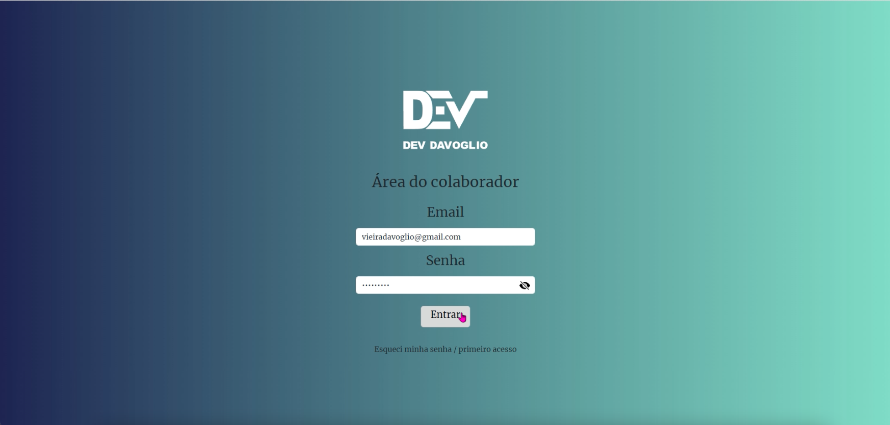

### Página Principal antes da demonstração

 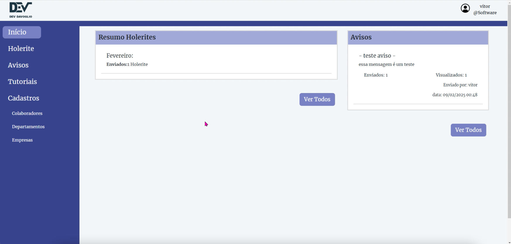

### Páginas da(s) empresa(s)

 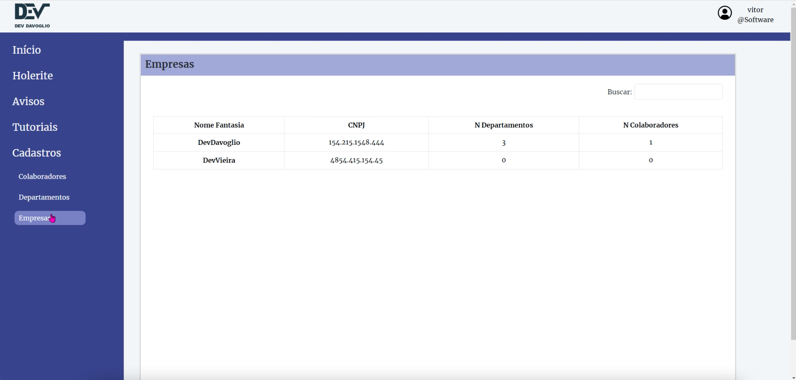
 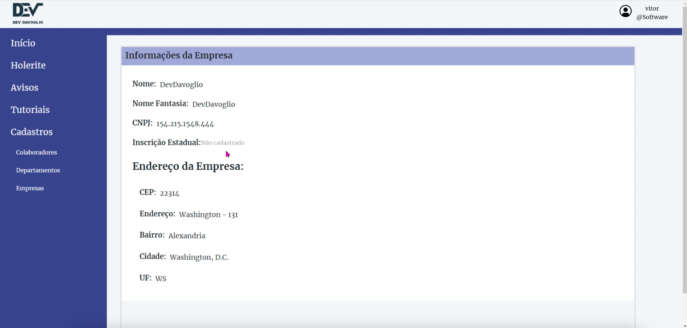

### Páginas dos departamentos

 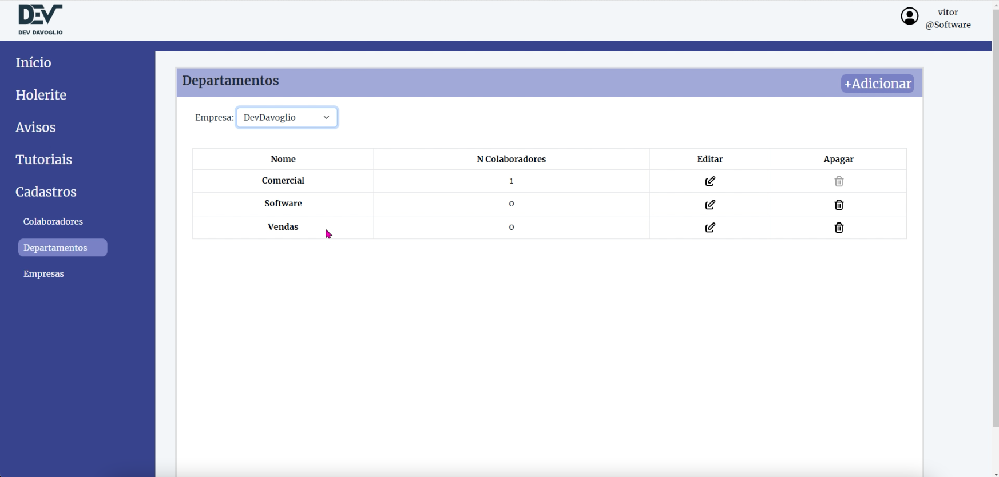
 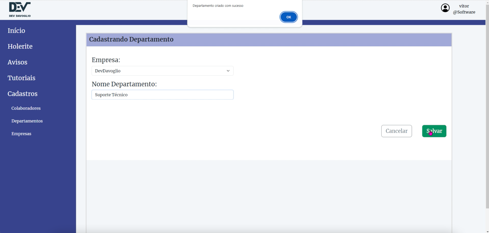

### Páginas dos colaboradores

 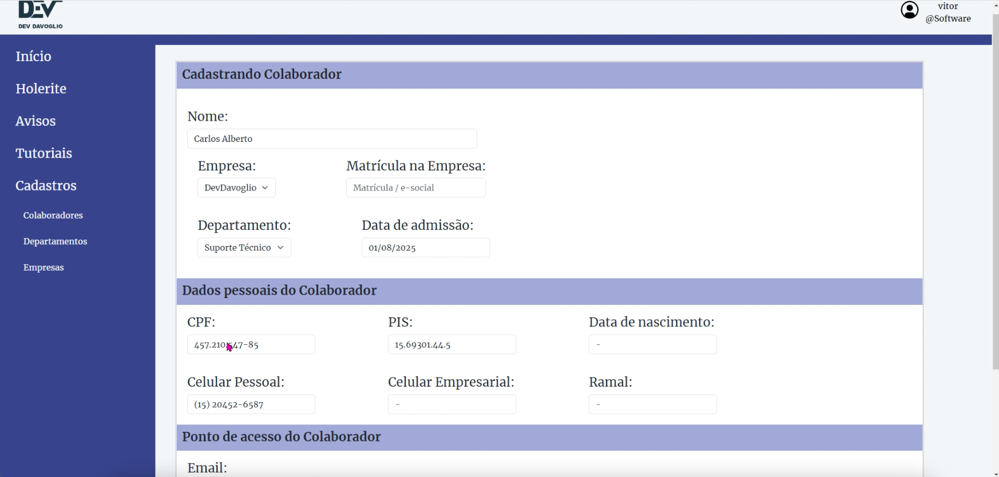
 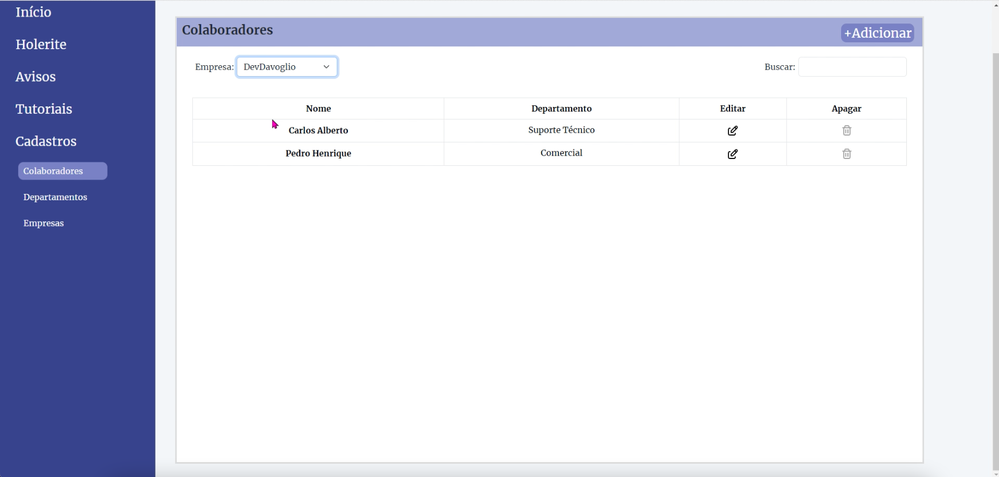

### Páginas dos avisos

 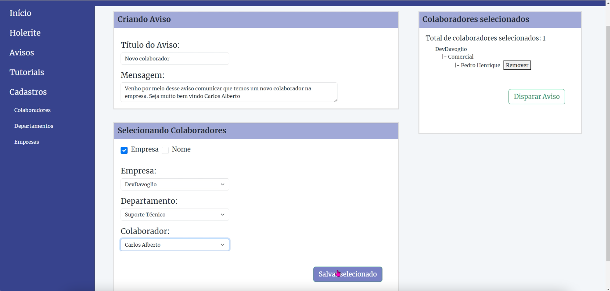
 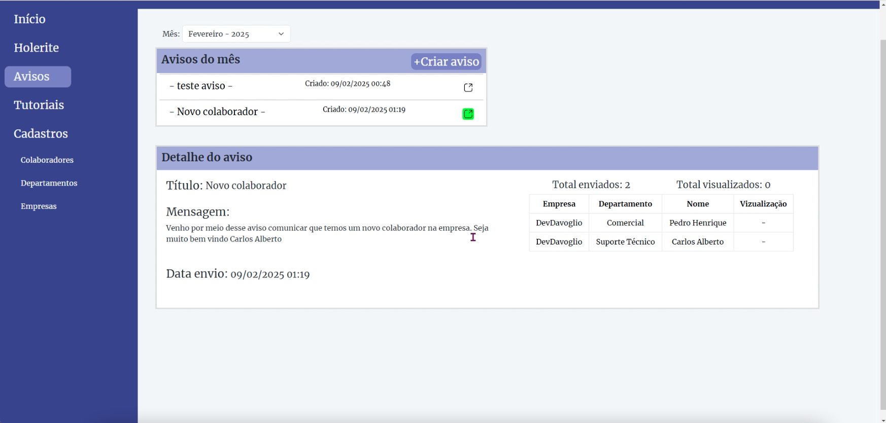

### Páginas dos holerites

 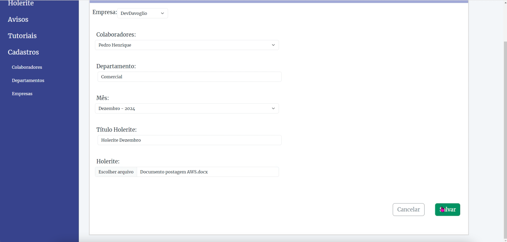
 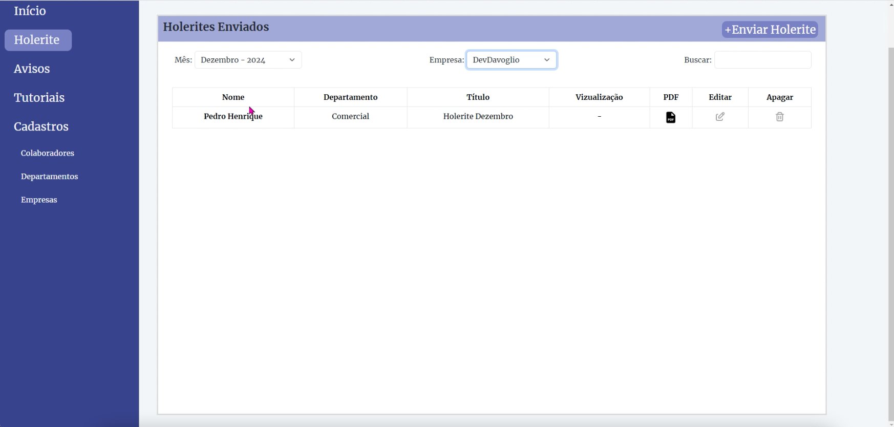

### Página principal após cadastramentos

 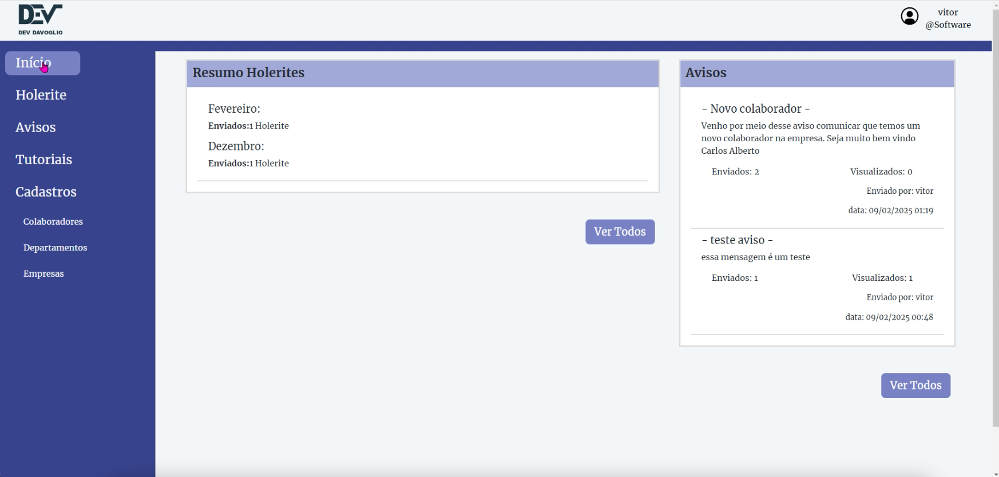

## Melhorias Futuras 📌
 * 📍 Implementação de notificações em tempo real
 * 📍 Melhorias na UI/UX
 * 📍 Relatórios personalizados por período

## Desenvolvimento 🚀
 @VitorVDavoglio